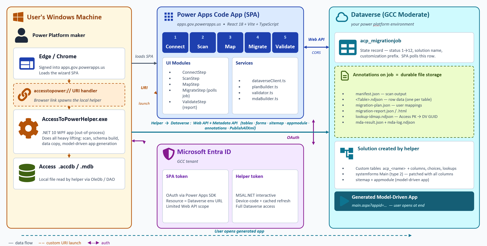

# Access to Power

A **Power Apps Code App** that migrates Microsoft Access databases (`.accdb`,
`.mdb`) to **Microsoft Dataverse** — schema, relationships, and data — with
a remediation report for anything that can't move automatically.

> Migrates: **tables, columns, relationships, data**
> Does **NOT** migrate: forms, reports, macros, VBA, queries, attachments, OLE objects

## 🚀 Install / get started

**New here? Read this first:**

| What | Where |
| --- | --- |
| 📘 **Step-by-step install guide** | [INSTALL.md](INSTALL.md) · or [printable PDF](https://github.com/kellycason/Access-To-Power/releases/latest/download/install.pdf) |
| 💾 **Download the Windows helper** | [latest release](https://github.com/kellycason/Access-To-Power/releases/latest) → `AccessToPowerHelper-x.x.x-win-x64.zip` |
| 🧩 **Dataverse solution (`acp_*` tables)** | [managed](https://github.com/kellycason/Access-To-Power/releases/latest/download/AccessToPower-0.1.1-managed.zip) · [unmanaged](https://github.com/kellycason/Access-To-Power/releases/latest/download/AccessToPower-0.1.1-unmanaged.zip) — import via Power Apps → Solutions → Import. |
| 🚀 **Deploy the Code App** (required) | clone this repo → `npm install` → `npm run power:push` (see [INSTALL.md](INSTALL.md)) |

> **Why isn't the Code App in the solution zip?** Power Apps Code Apps are in preview and [don't yet support solution packaging](https://learn.microsoft.com/power-apps/developer/code-apps/how-to/alm#limitations). Until Microsoft ships GA solution support, the Code App **must** be deployed by running `npm run power:push` from this repo. The solution zip above only contains the `acp_*` Dataverse tables.

You need: a Windows PC, a Power Apps Premium license, and a Dataverse environment where you're a System Customizer.



## Architecture

```
                    ┌─────────────────────────────────────────────────┐
                    │            Power Platform (cloud)               │
                    │                                                 │
  ┌────────────┐    │   ┌─────────────────┐    ┌──────────────────┐   │
  │  Browser   │◄──►│   │  Code App (UI)  │◄──►│    Dataverse     │   │
  │  (Entra)   │    │   │  React + Vite   │    │  migration tables│   │
  └────────────┘    │   └────────┬────────┘    │  + manifest blob │   │
                    │            │             │  + customer data │   │
                    │            ▼             └────────┬─────────┘   │
                    │   ┌─────────────────┐             │             │
                    │   │  Cloud flows    │◄────────────┘             │
                    │   │  - CreateSchema │  (status-driven triggers) │
                    │   │  - LoadData     │                           │
                    │   │  - ResolveFKs   │                           │
                    │   │  - Validate     │                           │
                    │   └─────────────────┘                           │
                    └─────────────────────────────────────────────────┘
                                  ▲
                                  │ uploads manifest + NDJSON
        ┌─────────────────────────┴────────────────────────┐
        │              Customer workstation                │
        │  ┌──────────────┐         ┌────────────────────┐ │
        │  │ Access .accdb│ ──────► │  Local helper      │ │
        │  │              │         │  (PAD or .NET tray)│ │
        │  └──────────────┘         │  ACE OLEDB reader  │ │
        │                           └────────────────────┘ │
        └──────────────────────────────────────────────────┘
```

**Code App** owns all UI and orchestration. **Dataverse** is the single
source of truth: it holds migration metadata, the manifest blob, mapping
decisions, the ID-mapping table for lookups, and the migrated customer
data itself. **Cloud flows** do the heavy server-side work. The **local
helper** is intentionally dumb — it just opens the `.accdb` via ACE OLEDB
and uploads what it finds. No product logic runs locally.

## Why a local helper at all?

Browsers cannot read `.accdb` files, and there is no Microsoft-supported
unattended ACE OLEDB runtime for Azure Functions / server-side processes.
A small local component is unavoidable for reading Access binary files.

Two acceptable forms with an identical contract:

1. **PAD flow** (v1 / demo) — Power Automate Desktop reads tables via
   `Read Access table` actions, writes the manifest + NDJSON to disk,
   uploads via the Dataverse connector.
2. **Signed .NET tray app** (v1.5) — invoked from the Code App through an
   `accesstopower://` protocol handler. Same manifest contract.

## Repo layout

```
access-to-power/
├── src/
│   ├── App.tsx               # 5-step wizard shell
│   ├── components/           # WizardNav + shared UI
│   ├── steps/                # Connect / Scan / Map / Migrate / Validate
│   ├── services/             # manifestSource, planBuilder
│   └── types/                # manifest.ts, migration.ts
├── public/
│   └── fixtures/             # Mock manifests for local dev
├── dataverse/
│   └── migration-schema.yml  # acp_migrationjob and friends
├── power.config.json         # Power Apps Code App config
├── vite.config.ts
└── package.json
```

## Dataverse schema (publisher prefix `acp`)

| Table                       | Purpose                                                    |
| --------------------------- | ---------------------------------------------------------- |
| `acp_migrationjob`          | One end-to-end migration run. Holds manifest + plan blobs. |
| `acp_migrationtable`        | One Access table being migrated. Holds the ID map.         |
| `acp_migrationcolumn`       | One Access column mapping decision.                        |
| `acp_migrationissue`        | Remediation items (Info / Warning / Error).                |
| `acp_migrationlog`          | Time-ordered execution log.                                |
| `acp_fieldmappingdecision`  | Cross-job learned type-mapping suggestions.                |

See [dataverse/migration-schema.yml](dataverse/migration-schema.yml) for
the full attribute list and the four cloud flows that act on these tables.

## Prerequisites

- **Power Apps Premium** license for end users (Code Apps requirement)
- **Dataverse environment** with table creation permissions
- **64-bit Microsoft Access Database Engine** on the workstation running
  the local helper
- Node 20+, npm 10+
- `@microsoft/power-apps` CLI (installed as a dependency)

## Getting started

```powershell
npm install
npm run dev                 # local Vite dev server with mock manifest
# Configure Dataverse target environment, then:
npm run power:init          # one-time, registers the Code App with PP
npm run power:run           # run inside Power Platform
npm run power:push          # build + push to the environment
```

Edit `power.config.json` to point at your environment:

- `region`: `unitedstates`, `gccmoderate`, `europe`, etc.
- `environmentId`: GUID of the target Dataverse environment
- `appId`: filled in by the CLI on first push

## Desktop helper distribution

Power Platform solution import does not install the Windows helper. The helper
must be packaged, hosted, and installed on each workstation that needs to read
Access databases.

Build the distributable helper zip:

```powershell
npm run helper:package
```

This creates `artifacts/AccessToPowerHelper-<version>-win-x64.zip`. Host that
zip in a trusted software distribution location such as Intune, an internal
software portal, Azure Blob Storage, or a release feed. Before building/pushing
the Code App, set:

```powershell
$env:VITE_HELPER_INSTALLER_URL = "https://contoso.example/downloads/AccessToPowerHelper-0.1.0-win-x64.zip"
$env:VITE_HELPER_INSTALLER_VERSION = "0.1.0"
```

The app will show this download link on the first step and in helper-launch
troubleshooting panels. The helper installer registers the per-user
`accesstopower://` protocol handler and adds an uninstall entry under Windows
Settings > Apps.

## Sample Access databases

The `samples/` folder contains generated `.accdb` files for repeatable test
runs:

- `northwind-lite.accdb` — baseline tables, relationships, currency, booleans, and memo fields.
- `hr-mid.accdb` — self-references, date+time values, currency, memo fields, and `SINGLE` floats.
- `library-complex.accdb` — deeper relationship chains, N:N-style junctions, byte values, and larger memo payloads.
- `edge-cases.accdb` — high-precision lat/long doubles, decimal precision, multiline/long memo text, lookup-wizard metadata, and unsupported binary-style fields.

Regenerate any sample with the matching `samples/create-*-accdb.ps1` script and `-Force`.

## License

[MIT](LICENSE) — use, fork, modify, and distribute freely, including commercially. No warranty.
